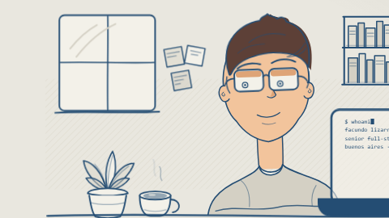
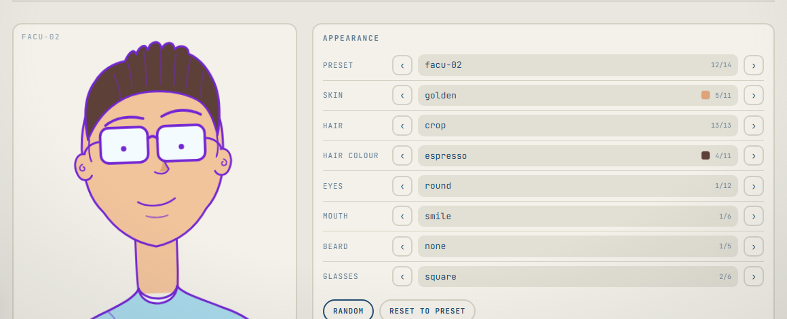

# @facundolizarraga/portfolio-characters

**A hand-drawn character who sits at a desk, types your stack into a laptop, and follows you down the page.**



It draws itself in, runs a scripted terminal on its laptop, follows the reader's cursor, and docks to the corner of the page as you scroll. Every part is swappable — 12 skin tones, 13 hairstyles, 11 hair colours, 12 eye styles, 6 mouths, 5 beards, 6 glasses, 14 presets, and a room you can furnish — and it ships its own builder UI:



## Install

```sh
npm i @facundolizarraga/portfolio-characters
```

React 18 or 19 as a peer dependency. ESM only.

## Use

```tsx
import { PortfolioCharacter } from '@facundolizarraga/portfolio-characters'
import '@facundolizarraga/portfolio-characters/styles.css'

export default function Hero() {
  return <PortfolioCharacter preset="preset-03" glasses="round" />
}
```

Give it something to say with a persona — who the character is and what it
types, with its own looks in `persona.appearance` that any part prop overrides:

```tsx
import { facundo } from '@facundolizarraga/portfolio-characters/personas'

;<PortfolioCharacter persona={facundo} variant="desk" dock gazeSelector="main section[id]" />
```

Just the character, no room or laptop:

```tsx
import { CharacterPortrait } from '@facundolizarraga/portfolio-characters'

;<CharacterPortrait crop="bust" hair="curly" glasses="cateye" />
```

The builder shown above is part of the library, not just a demo:

```tsx
import { CharacterBuilder } from '@facundolizarraga/portfolio-characters/builder'
import '@facundolizarraga/portfolio-characters/builder.css'

;<CharacterBuilder />
```

## Docs

- [`docs/PARTS.md`](docs/PARTS.md) — every prop and part id
- [`docs/ANATOMY.md`](docs/ANATOMY.md) — coordinate map and layer stack, for adding artwork
- [`PERSONA.md`](PERSONA.md) / [`persona.schema.json`](persona.schema.json) — writing a persona
- [`docs/PUBLISHING.md`](docs/PUBLISHING.md) — release process
- [`docs/MIGRATION.md`](docs/MIGRATION.md) — migrating from `@lizdevs/desk-character`

## Versioning

SemVer, but the package is `0.x` — a minor bump may break, particularly the
builder API. Pin exactly if that matters to you.

## Licence

MIT © Facundo Lizarraga
